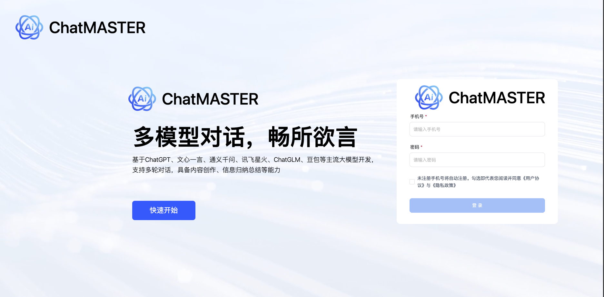
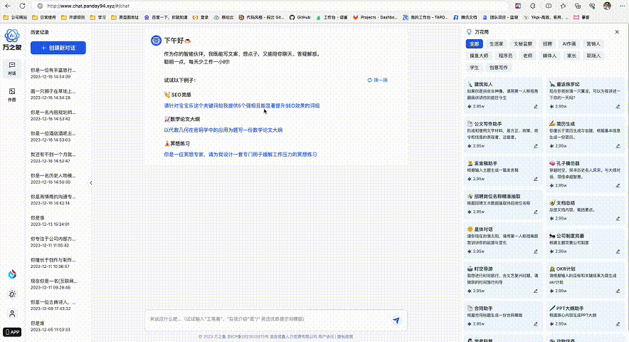
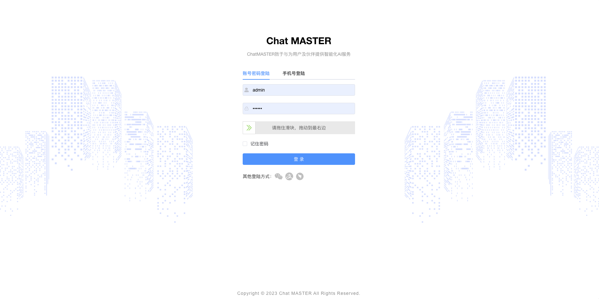
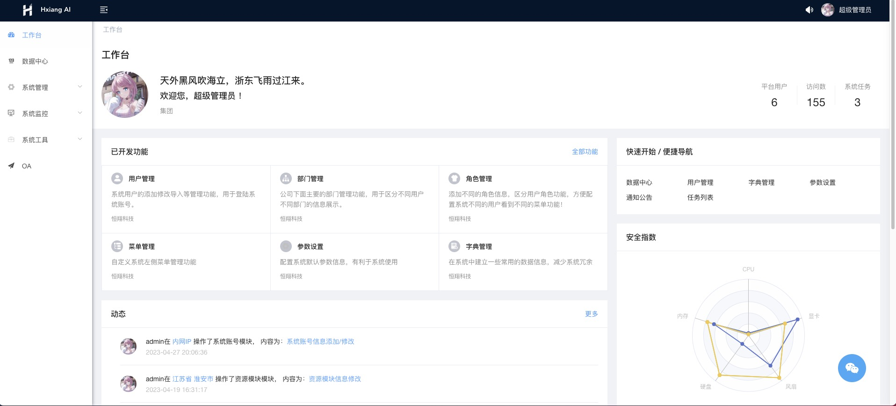

# Chat MASTER

    

# 项目简介
ChatMASTER，基于AI大模型api实现的自建后端Chat服务，支出同步响应及流式响应，完美呈现打印机效果。支持一键切换ChatGPT(3.5、4.0)模型、文心一言(支持Stable-Diffusion-XL作图)、通义千问、讯飞星火、智谱清言(ChatGLM)等主流模型，后续模型持续对接中。
项目包含java服务端、网页端、移动端及管理后台配置。

欢迎小伙伴或有合作意向的一起加入交流群[添加微信](#联系我们)或提Issues。使用参考下面具体介绍：

码云直通车[点我传送](https://gitee.com/panday94/chat-master)

* 支持文心一言Stable-Diffusion-XL作图功能
* 内置了各种assistant模版，按指定prompt输出，也可后台创建assistant模版
* 支持切换模型对话聊天，保存对话记录及根据上下文输出
* 管理端采用Vue2、Element UI，Chat网页端使用Vue3、TypeScript、NaiveUI进行开发
* 服务端采用Spring Boot、Spring Security + JWT、Mybatis-Plus、Lombok、 Mysql & Redis，代码通俗易懂，上手即用
* 完善的权限控制，权限认证使用Jwt，支持多终端认证系统
* 服务端项目，请移步[chat-master](https://gitee.com/panday94/chat-master)
* 管理端前端项目，请移步[chat-master-admin](https://gitee.com/panday94/chat-master-admin)
* 网页端项目，请移步[chat-master-web](https://gitee.com/panday94/chat-master-web)
* 移动端项目，请移步[chat-master-uniapp](https://gitee.com/panday94/chat-master-uniapp)
* 如需了解更多可访问[这里](https://www.yuque.com/the6/ct0azl/ehxcgoy0xg41l9c3?singleDoc# 《ChatMASTER部署教程》)
* 阿里云折扣场：[点我进入](https://www.aliyun.com/minisite/goods?userCode=iqguofg4)，腾讯云秒杀场：[点我进入](https://curl.qcloud.com/11y0ob0f)&nbsp;&nbsp;
* 阿里云优惠券：[点我领取](https://www.aliyun.com/daily-act/ecs/activity_selection?userCode=iqguofg4)，腾讯云优惠券：[点我领取](https://curl.qcloud.com/EUbjrCcu)&nbsp;&nbsp;

## 演示

网页端演示地址：https://gpt.panday94.xyz

移动端演示地址：https://gpt.panday94.xyz/h5

管理端演示地址：https://gpt.panday94.xyz/admin  密码：admin chatmaster

## 已实现功能
1. 多模型对话，支持ChatGPT(3.5、4.0)、文心一言(支持Stable-Diffusion-XL作图)、通义千问、讯飞星火、智谱清言(ChatGLM)
2. 支持后台配置及使用assistant模版，按指定prompt输出
3. 存储历史对话及聊天内容，可开启/关闭根据上下文输出
4. 支持按使用次数或者开通会员使用，也可全局判断不校验使用次数及会员，电量赠送次数或者不校验电量可在[chat-master-admin](https://gitee.com/panday94/chat-master-admin)中进行配置
5. 支持分享功能（基础上开发）
6. 支持个人信息修改

## 待实现功能
1. vip及svip开通功能
2. 分享赠送次数功能
3. 知识库功能
4. websocket响应（对接移动端）
5. 绘画
6. 用户上传自己密钥使用 

## 模型功能对比

> 版本记录请查看这里[版本记录](./CHANGELOG.md)

| 模型       | 是否支持System     | 天气查询       | 绘画                    |
|-----------|----------------|------------|-----------------------|
| ChatGPT   | 支持             | 不支持        | 支持                    |
| 文心一言    | 不支持(传递会报错)  | 可以回复(不准)   | 使用Stable-Diffusion-XL |
| 通义千问    | 支持             | 支持(效果没讯飞好) | 未接入                   |
| 讯飞星火    | 不支持(传递不会报错) | 支持(准)      | 不支持                   |
| 智谱清言    | 不支持(传递会报错)   | 不支持        | 支持（API待接入目前有点贵）       |

## 内置功能
1. 工作台：集成多个应用和功能的系统页面，该页面主要为用户提供快速访问、信息聚会、个性化等功能。
2. 数据中心：用于管理和分析系统数据的功能，向用户提供直观和易懂的信息，方便使用者快速了解系统数据。
3. 聊天管理：可以后台查看所有模型回复内容。
4. 订单管理：可以接入充值赠送模型使用次数功能。
5. 会员中心：查看所有用户信息，及开通模型次数功能。
6. 助手中心：配置Assistant分类及prompt信息。
7. 配置中心：配置系统可使用模型及移动端信息配置。
8. 系统管理：对系统中基础业务进行管理维护。
9. 系统监控：针对系统运行状态进行查看及定时任务配置管理

## 环境搭建/运行&提示

[这里](https://www.yuque.com/the6/ct0azl/ehxcgoy0xg41l9c3?singleDoc# 《ChatMASTER部署教程》)

## 参与贡献

贡献之前请先阅读 [贡献指南](./CONTRIBUTING.md)

个人的力量始终有限，任何形式的贡献都是欢迎的，包括但不限于贡献代码，优化文档，提交 issue 和 PR 等。
感谢所有做过贡献的人!

## 赞助

开源不易，如果你觉得这个项目对你有帮助，并且情况允许的话，可以给我一点点支持，总之非常感谢支持～

	

		
		
WeChat Pay

	

## 联系我们

	

## 扫码进群

    

## 许可证

[Apache License 2.0](./LICENSE)

Copyright (c) 2022 Master Computer Corporation Limited All rights reserved