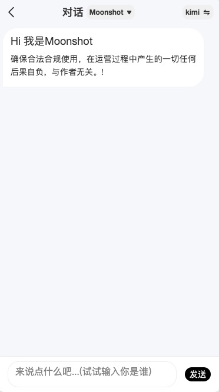
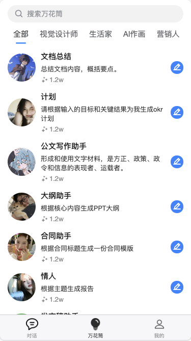
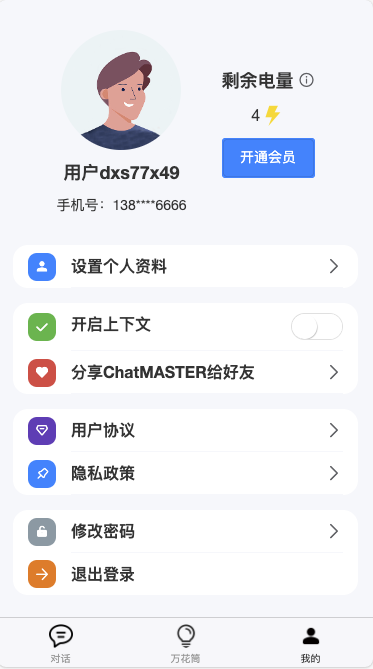

# Chat Master Uniapp

<p>
    <a href="#联系我们"></a>
</p>

> 声明：此项目只发布于码云和GitHub，基于 MIT 协议，免费且作为开源学习使用。并且不会有任何形式的卖号、付费服务、讨论群、讨论组等行为。谨防受骗。如需商用必须保留版权信息，请自觉遵守。确保合法合规使用，在运营过程中产生的一切任何后果自负，与作者无关。

> 支持一键切换ChatGPT(3.5、4.0)模型、文心一言、通义千问、讯飞星火、智谱清言(ChatGLM)等主流模型进行对话，支持文心一言(Stable-Diffusion-XL作图)功能，支持模型及助手后台自定义配置。

欢迎小伙伴一起加入交流群[添加微信](#联系我们)或提Issues。

* 服务端项目，请移步[chat-master](https://gitee.com/panday94/chat-master)
* 管理端项目，请移步[chat-master-admin](https://gitee.com/panday94/chat-master-admin)
* 网页端项目，请移步[chat-master-web](https://gitee.com/panday94/chat-master-web)
* 如需了解更多可访问[这里](https://www.yuque.com/the6/ct0azl/ehxcgoy0xg41l9c3?singleDoc# 《ChatMASTER部署教程》)

* 阿里云折扣场：[点我进入](https://www.aliyun.com/minisite/goods?userCode=iqguofg4)，腾讯云秒杀场：[点我进入](https://curl.qcloud.com/11y0ob0f)&nbsp;&nbsp;
* 阿里云优惠券：[点我领取](https://www.aliyun.com/daily-act/ecs/activity_selection?userCode=iqguofg4)，腾讯云优惠券：[点我领取](https://curl.qcloud.com/EUbjrCcu)&nbsp;&nbsp;





## 介绍

项目基于ChatGpt、文心一言、通义千问、讯飞星火、智谱清言等主流模型开发

| 名称                                          | 免费？ | 是否国内     | 地址 |
| --------------------------------------------- | ------ | ---------- | ---- |
| ChatGpt                          | 否     | 否       | https://chat.openai.com/ |
| 文心一言 | 否     | 是 | https://yiyan.baidu.com/ |
| 通义千问 | 否     | 是 | https://tongyi.aliyun.com/ |
| 讯飞星火 | 否     | 是 | https://xinghuo.xfyun.cn/ |
| 智谱清言 | 否     | 是 | https://chatglm.cn/ |


## 已实现路线
[✓] 多模型

[✓] 万花筒

[✓] 多会话储存和上下文逻辑

[✓] 对代码等消息类型的格式化美化处理

[✓] 个人信息修改及分享

[✗] More...

## 前置要求

### Node

`node` 需要 `^14 || ^18 ` ，使用 [nvm](https://github.com/nvm-sh/nvm) 可管理本地多个 `node` 版本

```shell
node -v
```

## 安装依赖

### 前端
根目录下运行以下命令
```shell
cp config-template.js config.js
npm install
```


## 参与贡献

贡献之前请先阅读 [贡献指南](./CONTRIBUTING.md) [版本记录](./CHANGELOG.md)

个人的力量始终有限，任何形式的贡献都是欢迎的，包括但不限于贡献代码，优化文档，提交 issue 和 PR 等。
感谢所有做过贡献的人!


## 赞助

如果你觉得这个项目对你有帮助，并且情况允许的话，可以给我一点点支持，总之非常感谢支持～

接定制开发，欢迎老板下单！

<div style="display: flex; gap: 20px;">
	<div style="text-align: center">
		
		<p>WeChat Pay</p>
	</div>
</div>

## 联系我们
<div style="display: flex;">
    
</div>

## License
MIT © [Master](./license)